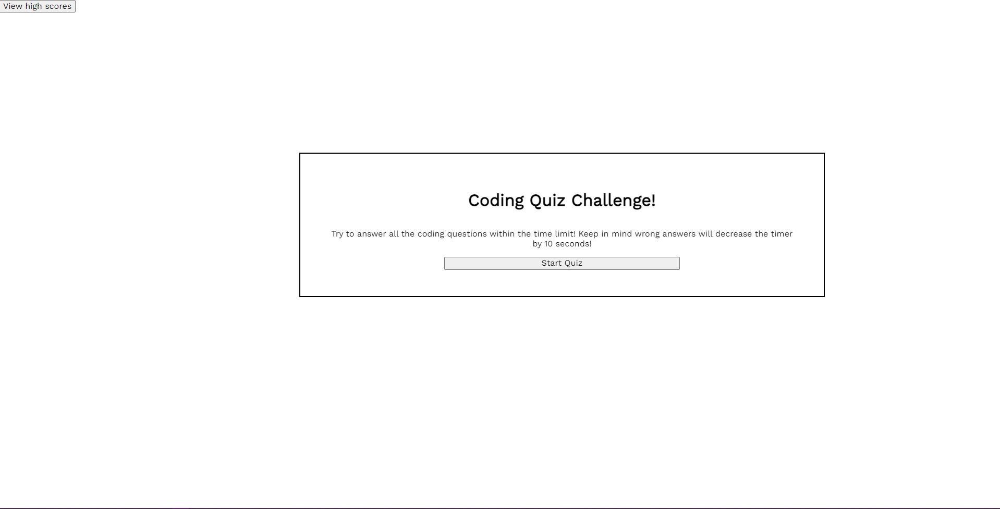

# < Code-Quiz >

## Description
For this personal project I decided to flex my Javascipt knowledge and build a little quiz. The focus would be on using dom manipulation to create a short quiz that would save a users score and initals, as well as be a small challenge.

## Usage

 Just click the start button, and try your best!

[Live site right here!](https://shadowasders.github.io/Code-Quiz/)

## Credits

I'd like to thank my instructors [Anthony Maddatu](https://github.com/amaddatu) and Andrew Reed (Github unavailable) for once again assisting me when things got confusing. I wouldn't have made it nearly as far as I have without their help!

## License

